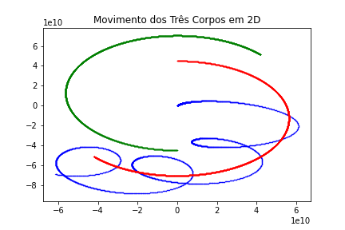

# Problema dos Três Corpos

Este repositório aborda o clássico **Problema dos Três Corpos** na mecânica celeste, implementando uma simulação numérica do movimento simultâneo de três corpos sob a ação da gravidade. Os dados gerados pela simulação são utilizados para plotar gráficos representando as trajetórias dos corpos ao longo do tempo.

## :rocket: Objetivo

Simular o comportamento dinâmico de três corpos interagindo gravitacionalmente em um plano 2D, utilizando dados de entrada definidos pelo usuário, e visualizar o resultado graficamente.

---

## :open_file_folder: Conteúdo do Repositório

- `3body.in` — [Exemplo de arquivo de entrada com dados iniciais de posição, velocidade e massa dos três corpos, além do tempo total de simulação e intervalo de tempo.](#3body.in)
- `read_movement.py` — [Código principal que simula o movimento dos corpos ao longo do tempo e gera um arquivo de saída com as posições dos corpos a cada passo.](#read_movement.py)
- `3body.out` — [Exemplo de arquivo de saída gerado após a simulação.](#3body.out)
- `plot_graphs.py` — [Script para leitura do arquivo de saída e geração do gráfico com as trajetórias dos corpos.](#plot_graphs.py)
- `3body.out.png` — [Exemplo de gráfico plotado com as trajetórias dos corpos em 2D.](#3body.out.png)

---

## :page_facing_up: Estrutura do Arquivo de Entrada

O arquivo de entrada (`.in`) deve conter, **linha por linha**:

```
rx1 ry1 vx1 vy1 m1
rx2 ry2 vx2 vy2 m2
rx3 ry3 vx3 vy3 m3
tempo_total
intervalo_tempo
```

- `rx`, `ry` – posição inicial (em metros)
- `vx`, `vy` – velocidade inicial (em m/s)
- `m` – massa do corpo (em kg)
- `tempo_total` – tempo total da simulação (em segundos)
- `intervalo_tempo` – passo de tempo da simulação (em segundos)

### :pushpin: Exemplo:

```
0.0e00  0.0e00   0.05e04 0.0e00  5.97e24
0.0e00  4.5e10   3.0e04  0.0e00  1.989e30
0.0e00 -4.5e10  -3.0e04  0.0e00  1.989e30
10000000
1500
```

---

## 🧠 Simulação do Movimento – `read_movement.py`

Este script:

- Lê o arquivo `.in` com os dados iniciais dos corpos.
- Aplica a Lei da Gravitação Universal para calcular as forças entre os corpos.
- Usa as equações do movimento (segunda lei de Newton) para atualizar posição e velocidade a cada passo.
- Escreve as posições dos corpos ao longo do tempo em um arquivo `.out`.

---

## 📊 Geração de Gráfico – `plot_graphs.py`

Este script:

- Solicita o nome do arquivo `.out` gerado pela simulação.
- Lê e organiza os dados de posição de cada corpo ao longo do tempo.
- Gera um gráfico com as trajetórias de cada corpo em 2D.
- Salva a imagem como `.png`.

### 📌 Exemplo de saída gráfica:



---

## :computer: Requisitos

- Python 3
- `matplotlib`

Instale a dependência com:

```
pip install matplotlib

```

---
